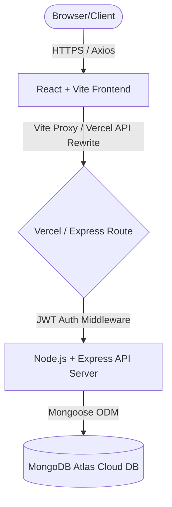

# 🤝 SkillX - Full-Stack Skill Exchange Platform

[](https://reactjs.org/)
[](https://nodejs.org/)
[](https://expressjs.com/)
[](https://www.mongodb.com/)
[](https://tailwindcss.com/)
[](https://vercel.com/)

SkillX is a modern, full-stack peer-to-peer skill-sharing platform designed to bridge the gap between learners and teachers. Users can register, create dynamic profiles detailing their expertise and learning goals, discover matches based on algorithmic filters, send exchange requests, and converse in real-time.

---

## 🎓 Academic Practicum Details
* **Project Title:** SkillX - Peer-to-Peer Skill Exchange Platform
* **Course:** Practicum
* **Institution:** IUBAT – International University of Business Agriculture and Technology
* **Department:** Department of Computer Science & Engineering (CSE)

### Project Developer:
* **Name:** Gazi Faizul Islam
* **Student ID:** 22203175
* **Semester:** 12
* **Supervisor:** Sajia Bintea Jahangir

---

## 🚀 Key Features

* **🔐 Advanced Authentication:** Secure register/login flow using JSON Web Tokens (JWT) and encrypted passwords (bcrypt). Includes route guarding (guest-only and private routes).
* **👤 Dynamic Profile Management:** Users can manage display names, avatars, offered/wanted skills, teaching availability, and personal biographies.
* **🔍 Intelligent Match Discovery:** Discover potential skill-sharing partners using real-time filters (by skill name, level, and category).
* **💬 Real-Time Chat & Dashboard:** Integrated dashboard to view active connections, pending requests, and a messaging module for active exchanges.
* **📬 Interactive Request Flow:** Send, accept, or decline skill-exchange requests with real-time status updates.
* **⭐ Peer Review System:** Rate and write feedback for other users upon successfully completing a skill exchange.
* **🛡️ Admin Management Panel:** Dedicated dashboard for administrators to monitor platform metrics and manage users.

---

## 🛠️ Tech Stack & Architecture



### Frontend
* **Core Library:** React 19
* **Routing:** React Router v7
* **Styling:** Tailwind CSS v4 (Glassmorphism & dark-mode support)
* **HTTP Client:** Axios for asynchronous API communication

### Backend
* **Runtime:** Node.js (ES Modules syntax)
* **Framework:** Express.js
* **Database Access:** Mongoose (Object Document Mapper)
* **Security:** JWT (jsonwebtoken) & bcrypt (password hashing)

---

## 📁 Directory Structure

```text
skill-exchange-platform/
├── api/                  # Vercel Serverless Function entry point
│   └── index.js
├── public/               # Static frontend assets
├── src/                  # React Frontend source files
│   ├── components/       # Reusable UI components & layouts
│   ├── context/          # Context API (Auth, Theme, Toasts)
│   ├── layouts/          # Page layouts (Main Layout)
│   ├── lib/              # Utility configurations (API client, Auth storage)
│   ├── pages/            # View pages (Dashboard, Chat, Profiles)
│   ├── App.jsx           # App shell & router configurations
│   └── main.jsx          # React DOM mounting entry point
├── server/               # Express Backend source files
│   ├── bootstrap/        # Initial seeding (Admin setup)
│   ├── config/           # Environment and DB config
│   ├── controllers/      # Route controllers (Auth, Chat, Matches)
│   ├── middleware/       # JWT auth & validation middlewares
│   ├── models/           # Mongoose schemas (User, Request, Message)
│   ├── routes/           # Express API endpoints
│   ├── app.js            # Express app configuration
│   └── index.js          # Local backend runner
├── vercel.json           # Vercel routing & proxy configuration
└── vite.config.js        # Vite compiler configurations
```

---

## 💻 Local Development Setup

### Prerequisites
* [Node.js](https://nodejs.org/) installed (v18+ recommended)
* [MongoDB Atlas](https://www.mongodb.com/cloud/atlas) account and database cluster

### 1. Installation
Clone the repository and install dependencies for both the frontend and backend:
```bash
# Install frontend dependencies (root)
npm install

# Install backend dependencies (server folder)
npm install --prefix server
```

### 2. Environment Configuration
Create a `.env` file inside the `server/` directory:
```bash
# Navigate to server and copy the example
cp server/.env.example server/.env
```
Open `server/.env` and fill in the required variables:
```env
NODE_ENV=development
PORT=5000
MONGODB_URI=your_mongodb_atlas_connection_string
JWT_SECRET=your_jwt_signing_secret_key
JWT_EXPIRES_IN=7d
```

### 3. Run Locally
Open two separate terminal windows from the project root:

* **Terminal 1 (Backend API Server):**
  ```bash
  npm run server:dev
  ```
* **Terminal 2 (Frontend Vite Server):**
  ```bash
  npm run dev
  ```

*For Windows PowerShell execution policy issues, run:*
```powershell
npm.cmd run server:dev
npm.cmd run dev
```
The application will run locally at `http://localhost:5173`, proxying `/api` requests to `http://localhost:5000`.

---

## ☁️ Deployment (Vercel)

This project is fully optimized to be deployed to **Vercel** with both the frontend and backend running on the same domain.

### Environment Variables on Vercel:
Before building, add the following variables under **Project Settings > Environment Variables**:
* `MONGODB_URI` - Your MongoDB Atlas Connection String
* `JWT_SECRET` - A strong secret key used to sign JWTs

The `vercel.json` file in the root will automatically route all `/api/*` endpoints to the serverless function wrapper (`api/index.js`) while routing all other requests to the client-side SPA routing (`index.html`).
